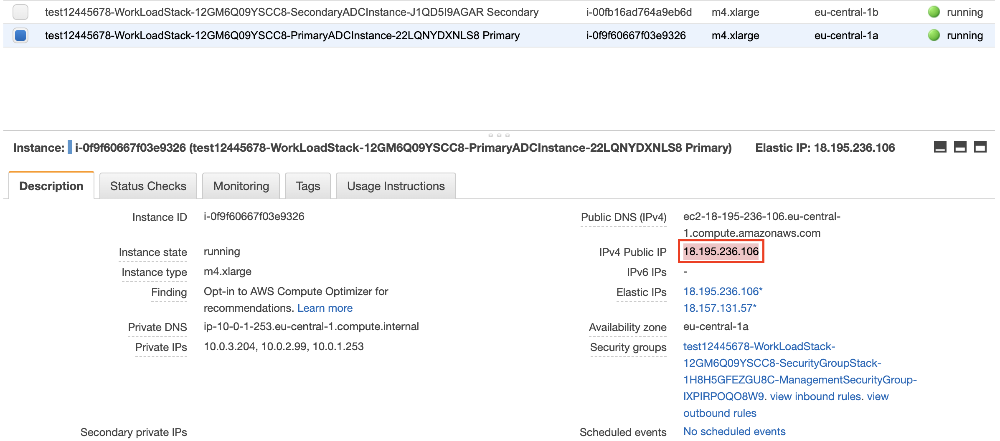
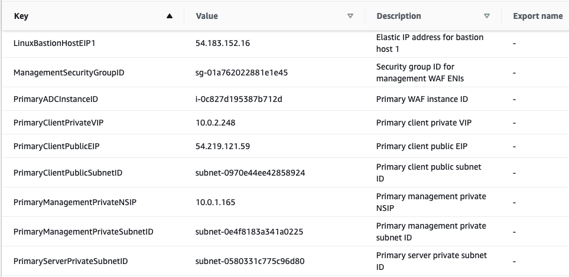
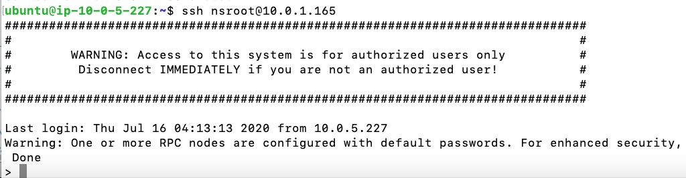
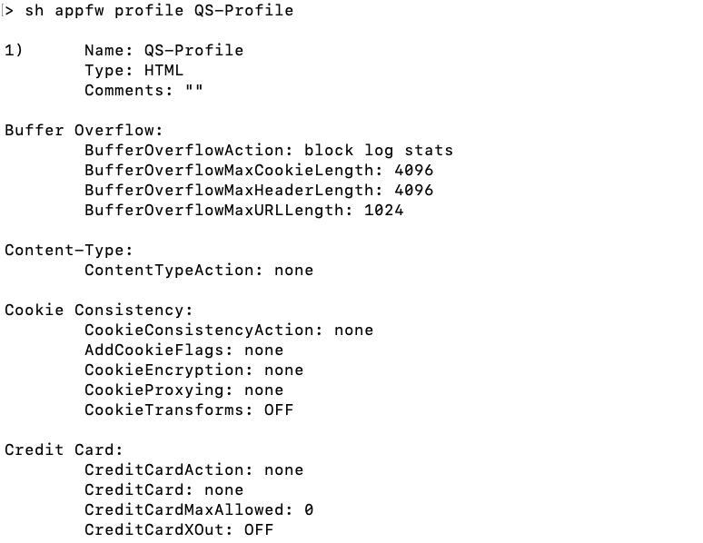
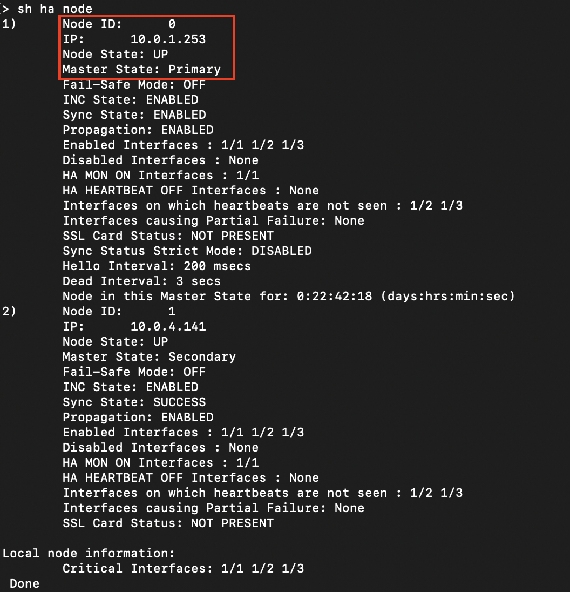
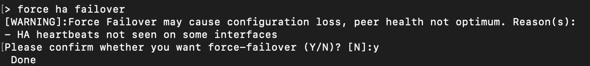
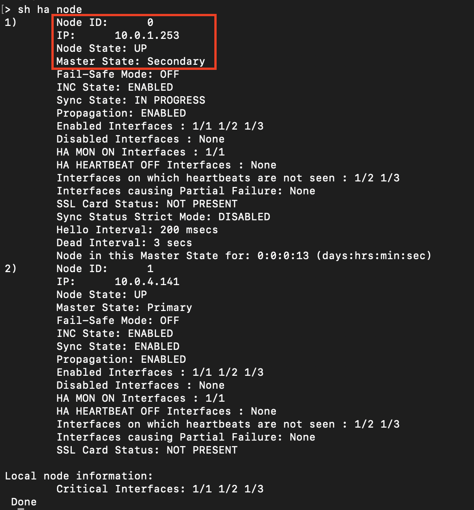

// Add steps as necessary for accessing the software, post-configuration, and testing. Don’t include full usage instructions for your software, but add links to your product documentation for that information.
//Should any sections not be applicable, remove them

== Test the deployment

=== Connect to the primary Citrix WAF instance
Connect to the management interface of the primary Citrix WAF instance in accordance with your deployment scenario (sandbox or production):

==== Production deployment (no bastion host provisioned—the default)

. You can connect to the primary Citrix WAF instance by using a proxy server, a jump host (a Linux/Windows/FW instance running in AWS, or the bastion host) or another device reachable to that VPC or a Direct Connect if dealing with on-prem connectivity.
. Alternatively, you can make the management network interface reachable from outside the VPC. And then, connect to the primary Citrix WAF instance directly using SSH connecting to the NSIP with username nsroot and the password being the instance ID for the primary instance. +
 +
For testing purpose, attach two Elastic IP addresses with the primary instance so as to make the management network interface reachable from outside, one with client network interface (VIP) and the other with management interface (NSIP). To get administrative access to the primary WAF instance,
use the IPv4 public IP associated with the eth0 interface as shown in <<testStep1>>.

:xrefstyle: short
[#testStep1]
.Retrieving the NSIP to connect to the primary WAF instance for production deployment
[link=images/retrieve-primary-waf-nsip.png]


==== Sandbox deployment (bastion host provisioned—optional)

. In the https://console.aws.amazon.com/cloudformation/[AWS CloudFormation console], choose the root stack.
. On the *Outputs* tab, as shown in <<testStep2>>, note the values for *LinuxBastionHostEIP1*, *PrimaryManagementPrivateNSIP*, and *PrimaryADCInstanceID*.

:xrefstyle: short
[#testStep2]
.Citrix WAF HA pair deployment resources
[link=images/sandbox-deployment-resources.png]


[start=3]
. To store the key in your keychain, run the command `ssh-add -K _<your-key-pair>_.pem`. (On Linux terminal, you might need to omit the -K flag.)
. Log in to the bastion host using the following command, using the value for *LinuxBastionHostEIP1* that you noted in step 2.

```
ssh -A ubuntu@<LinuxBastionHostEIP1>
```

[start=5]
. From the bastion host, as shown in <<testStep3>>, you can connect to the primary WAF instance by using SSH with username *nsroot* and *PrimaryManagementPrivateNSIP* (associated with eth0) and password being *PrimaryADCInstanceID* noted in step 2.

```
ssh nsroot@<Primary Management Private NSIP>

Password: <Primary ADC Instance ID>
```

:xrefstyle: short
[#testStep3]
.Connecting to the primary Citrix WAF instance
[link=images/primary-instance-connection.png]


=== Validate the deployment

In the previous step, you connected to the primary Citrix WAF instance for either the production or the sandbox deployment scenarios. Here are few commands you can try.

. To view the current HA configuration, you can run the `show ha node` command.
. To verify that QS-Profile is present, run `sh appfw profile QS-Profile` command.

:xrefstyle: short
[#testStep4]
.Citrix WAF profiles
[link=images/show-profile.png]


=== Test failover

When the Quick Start has been deployed successfully, traffic goes through the primary Citrix WAF instance,
which is configured in Availability Zone 1. During failover conditions, when the primary instance does not respond to client requests,
the secondary WAF instance takes over. The Elastic IP address of the virtual IP address of the primary instance migrates to the
secondary instance, which takes over as the new primary instance. We can test the deployment by verifying this failover,
where Citrix WAF does the following:

* Checks the virtual servers that have IP sets attached to them.
* Finds the IP address that has an associated public IP address from the two IP addresses that the vserver is listening on. One that is directly attached to the vserver, and one that is attached through the IP set.
* Reassociates the public Elastic IP address to the private IP address that belongs to the new primary virtual IP address.

To test failover, follow these steps.

. Run the `sh ha node` command. Notice that the instance master state is primary, as shown in <<testStep5>>.

:xrefstyle: short
[#testStep5]
.Citrix WAF nodes before failover—master state as primary
[link=images/waf-nodes-before-failover.png]


[start=2]
. Run the `force ha failover` command. When prompted *Please confirm whether you want force-failover*, as shown in <<testStep6>>, enter Y.
This initiates the failover condition.

:xrefstyle: short
[#testStep6]
.Initiating force-failover test
[link=images/force-ha-failover.png]


[start=3]
. Run the `sh ha node` (show) command. Notice that the instance master state has changed to secondary, as shown in <<testStep7>>.

:xrefstyle: short
[#testStep7]
.After failover—master state changed to secondary
[link=images/after-failover.png]


[start=4]
. In the Amazon EC2 console, check the Elastic IP address assigned to the primary WAF instance. Notice that after failover this address migrated to the secondary instance.

== Best practices for using Citrix WAF on AWS

For deploying a Citrix WAF instance on AWS, certain limitations and usage information needs to be adhered to. See the https://docs.citrix.com/en-us/citrix-adc/12-1/deploying-vpx/deploy-aws/vpx-aws-limitations-usage-guidelines.html[limitations and usage guidelines] on the Citrix website.

For information about configuration details that apply to WAF HA pair, see https://docs.citrix.com/en-us/citrix-adc/13/deploying-vpx/deploy-aws/high-availability-different-zones.html#how-high-availability-across-aws-availability-zones-works[How high availability across AWS Availability Zones work] the Citrix website.
