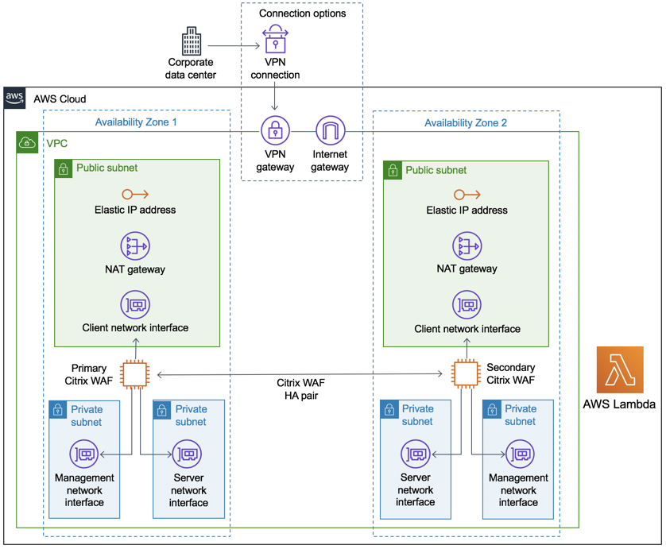

Deploying this Quick Start for a new virtual private cloud (VPC) with
*default parameters* builds the following _{partner-product-short-name}_ environment in the
AWS Cloud.

// Replace this example diagram with your own. Send us your source PowerPoint file. Be sure to follow our guidelines here : http://(we should include these points on our contributors giude)
[#architecture1]
.Quick Start architecture for _{partner-product-short-name}_ on AWS
[link=images/architecture_diagram.png]

As shown in <<architecture1>>, the Quick Start sets up the following:

* A highly available architecture that spans two Availability Zones.*
* A virtual private cloud (VPC) configured with two public and four private subnets, according to AWS best practices.*
* An internet gateway attached to the VPC, and route tables associated with public subnets, to allow access to the internet. This gateway is used by the WAF host to send and receive traffic. (The VPN connection and VPN gateway shown here are not deployed as part of the Quick Start; they represent a way to connect to the VPC privately instead.)*
* Two instances of Citrix WAF (primary and secondary), one in each Availability Zone. Together, these are called the Citrix WAF HA pair.
* Three security groups (not shown), each spanning the two Availability Zones and acting as a virtual firewall to control the traffic for the WAF instances: 
   ** A security group for the client network interfaces.
   ** A security group for the server network interfaces.
   ** A security group for the management network interfaces.
* In the public subnets:
   ** Managed network address translation (NAT) gateways with associated Elastic IP addresses to allow outbound internet access for resources in the private subnets.*
   ** An elastic network interface for the client network interface (VIP) of the Citrix WAF instance.
   ** An optional Linux bastion host (not shown) in an Auto Scaling group to allow inbound Secure Shell (SSH) access to Amazon Elastic Compute Cloud (Amazon EC2) instances in public and private subnets.*
   ** An optional Elastic IP address (not shown) attached to the client network interface of the primary Citrix WAF instance. 
* In the private subnets (two per Availability Zone): 
   ** An elastic network interface with a private IP address for the management network interface (NSIP) of the Citrix WAF instance. 
   ** An elastic network interface with a private IP address for the server network interface (SNIP) of the Citrix WAF instance.
* AWS Lambda functions to configure Citrix WAF high availability and load balancing.
* An AWS Identity and Access Management (IAM) role to securely control access to AWS services and resources for your users. By default, the deployment creates the required IAM role. Alternatively, you can provide your own. See https://docs.citrix.com/en-us/citrix-adc/13/deploying-vpx/deploy-aws/prerequisites.html[Prerequisites].

*The template that deploys the Quick Start into an existing VPC skips the components marked by asterisks and prompts you for your existing VPC configuration.

NOTE: Backend servers are not deployed by the Quick Start. If you intend to use the Quick Start for a sandbox deployment, deploy a Linux bastion host in the public subnet (by choosing *Create bastion host*, as documented later). This allows inbound Secure Shell (SSH) access to EC2 instances in public and private subnets. An Elastic IP address is allocated to that bastion host.
