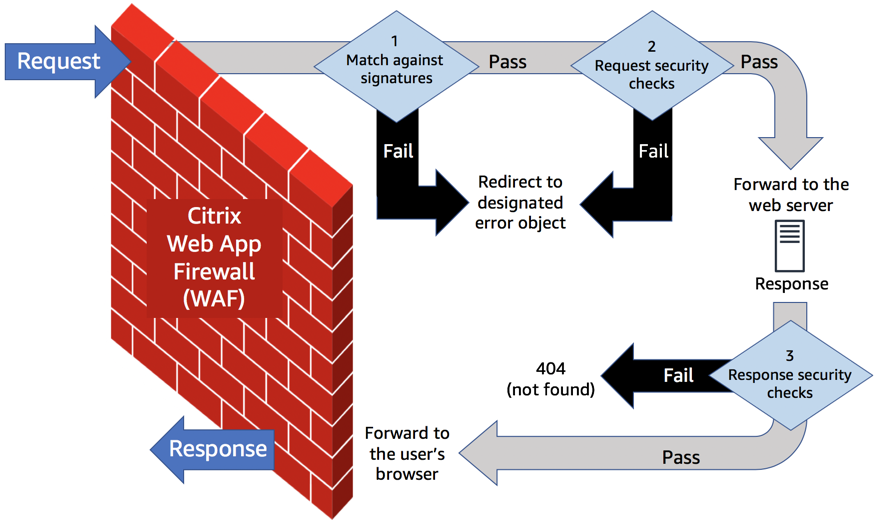

// Replace the content in <>
// Briefly describe the software. Use consistent and clear branding. 
// Include the benefits of using the software on AWS, and provide details on usage scenarios.
:xrefstyle: short
//Moved this line up to precede the figure cross-ref. so that it says "as shown in Figure 1" correctly.

Citrix WAF is a firewall that protects web applications and sites from both known and unknown attacks, including application-layer and zero-day threats. Citrix WAF is positioned in front of a web server, monitoring web traffic before it reaches the web application, as shown in <<product1>>.

[#product1]
.How Citrix WAF works on AWS
[link=images/how-citrix-waf-works.png]

Citrix WAF filters requests to and from the web server as follows:

1.  When a request comes in, Citrix WAF matches it against the signatures that protect your websites against known attacks. If any of these checks fail, WAF redirects the request to a user-designated error object.
2.  If the request passes the signature checks, WAF performs other security checks, such as SQL injection, cross-site scripting, buffer overflow, etc. If any of these checks fail, WAF redirects the request to a user-designated error object.
3.  If the request passes all the incoming checks, WAF forwards it to the web server. It then performs security checks on the server’s responses and outgoing requests, such as those pertaining to sensitive data, credit cards, and social security numbers. If any security check fails, WAF responds with a 404. If they all pass, WAF forwards the request to the user’s browser.

Citrix WAF is based on a https://www.citrix.com/products/citrix-adc/platforms.html[Citrix Application Delivery Controller (ADC) platform]. Citrix ADC platforms have a single code base that enables consistency across your applications and workflows. This Quick Start deploys an HA pair of Citrix ADC instances with WAF enabled.

Specifically, this Quick Start uses https://www.citrix.com/products/citrix-adc/resources/citrix-adc-vpx.html[Citrix ADC VPX] virtual appliances to deploy Citrix WAF on the AWS Cloud. The Citrix ADC VPX virtualizes your networking infrastructure. With the Citrix ADC VPX, functionality that’s typically available only on specialized, high-end network devices is available dynamically on a single server or across enterprise data centers.

You can customize this Quick Start by changing the configuration parameters. The Quick Start deploys a full working stack that you can inspect and use as a reference. You can deploy more than one WAF node by launching the AWS CloudFormation template multiple times.